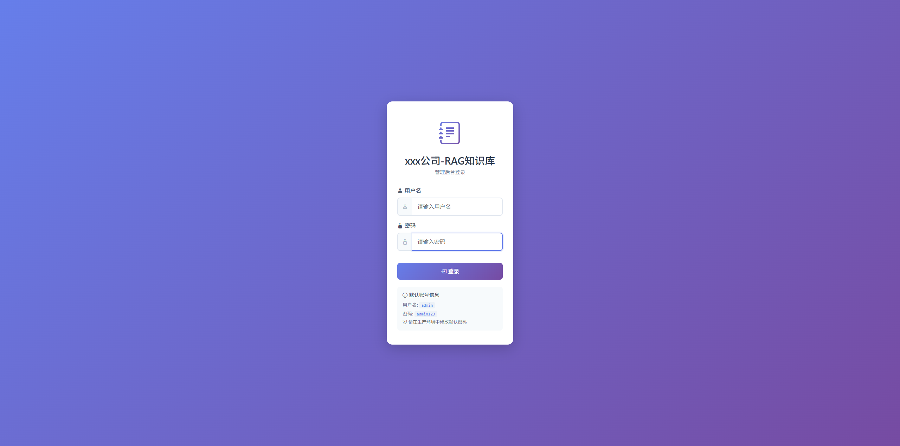
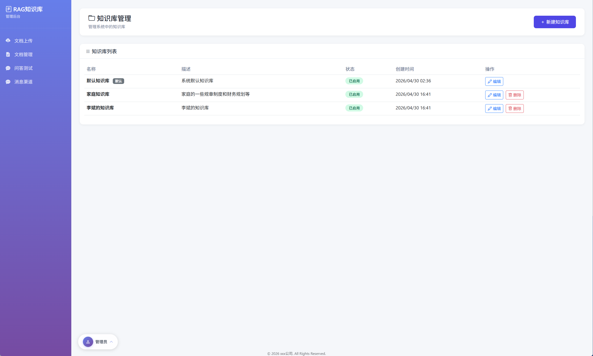
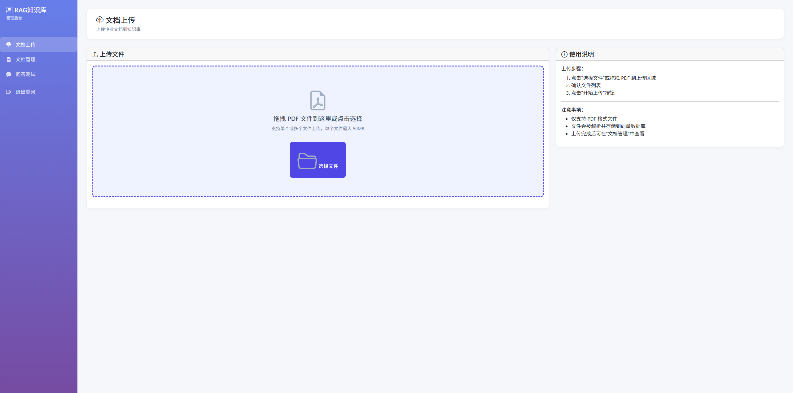
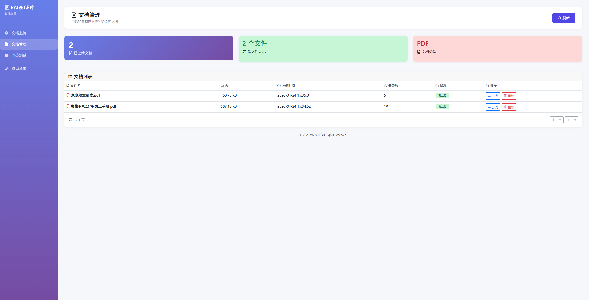
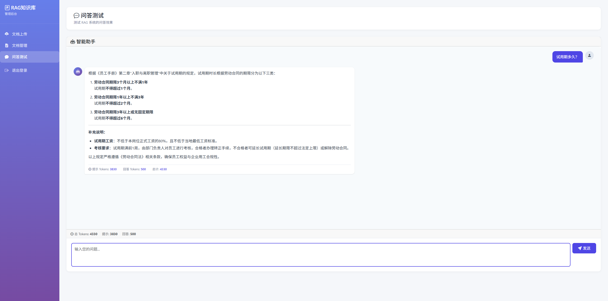
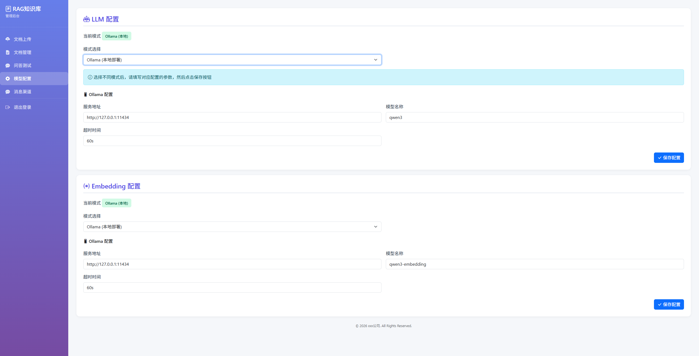
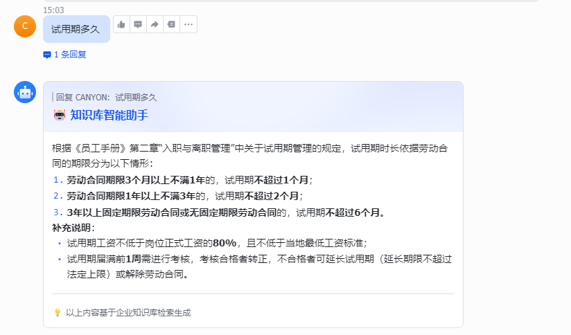

# RAG 知识库系统

[English](README_en.md) | 中文

基于 LangChain4j 的 RAG（Retrieval-Augmented Generation，检索增强生成）知识库问答系统，支持 Web 管理后台、REST API、流式问答，并集成飞书与钉钉机器人。

## 功能特性

- **RAG 全流程**：PDF 解析、分块、向量化、pgvector 检索、LLM 生成
- **多模型支持**：DashScope（云端）、Ollama（本地）、OpenAI 协议模型可切换
- **双入口调用**：管理后台页面 + 开放 REST API
- **流式问答**：支持 SSE 流式输出
- **机器人接入**：飞书机器人、钉钉机器人
- **可观测性**：关键链路日志（含检索增强阶段耗时）
- **模型配置管理**：支持后台界面实时配置 LLM 和 Embedding 模型
- **消息渠道管理**：支持飞书、钉钉机器人启用/停用
- **知识库管理**：支持多知识库创建、启用/停用、切换

## 技术栈

### 后端
- Java 21
- Spring Boot 4.0.5
- Sa-Token 1.36.0（认证授权）
- LangChain4j 0.36.2
- MyBatis-Plus 3.5.15
- PostgreSQL
- pgvector (PostgreSQL 扩展)
- Hutool 5.8.x

### 前端
- Vue 3
- Ant Design Vue 4
- Vite 5
- Axios
- Marked.js + Highlight.js

### 部署
- Docker / Docker Compose

## 项目结构

```
rag-knowledge-base-network/
├── backend/                                # Spring Boot 后端
│   ├── src/main/java/com/bintech/rag/
│   │   ├── controller/                    # API 控制器
│   │   ├── service/                       # 核心业务逻辑
│   │   │   ├── dingtalk/                  # 钉钉集成
│   │   │   └── feishu/                    # 飞书集成
│   │   ├── repository/                    # 数据访问层
│   │   │   ├── mapper/                    # Mapper 接口
│   │   │   └── entity/                    # 实体类（DO）
│   │   ├── config/                        # 配置类（含 Sa-Token 配置）
│   │   ├── context/                       # 上下文
│   │   └── enums/                         # 枚举常量
│   ├── src/main/resources/
│   │   ├── application.yml                # 系统配置
│   │   └── static/                        # 前端构建产物
│   ├── pom.xml                            # Maven 配置
│   └── Dockerfile                         # 后端容器构建
│
├── frontend/                              # Vue 3 前端项目
│   ├── src/
│   │   ├── api/                           # API 请求层 (Axios + Sa-Token 拦截)
│   │   ├── router/                        # 路由配置（含登录守卫）
│   │   └── views/
│   │       ├── Login.vue                  # 登录页
│   │       └── admin/
│   │           ├── Layout.vue             # 后台布局（侧边栏 + 顶栏）
│   │           ├── Upload.vue             # 文档上传
│   │           ├── Documents.vue          # 文档管理
│   │           ├── Chat.vue               # 问答测试（SSE 流式）
│   │           ├── Config.vue             # 模型配置
│   │           ├── Channel.vue            # 消息渠道
│   │           └── KnowledgeBase.vue      # 知识库管理
│   ├── package.json
│   └── vite.config.js
│
├── .doc/
│   └── db/                                # 数据库脚本
├── docker-compose.yml                     # 容器编排
├── AGENTS.md                              # 项目通用规范
└── CLAUDE.md                              # 子规范引用清单
```

核心资源：
- `frontend/`：Vue 3 前端源码，构建后输出至 `backend/src/main/resources/static/`
- `backend/src/main/resources/application.yml`：系统配置
- `docker-compose.yml`：PostgreSQL (pgvector) + MinIO + 应用一体化编排

## 快速开始

### 方式一：Docker Compose（推荐）

1. 准备 `.env` 文件（可参考 `.env.example`）
2. 配置环境变量
3. 构建前端：`cd frontend && npm install && npm run build`
4. 启动服务：
   - Windows：`start.bat`
   - macOS/Linux：`docker-compose up -d`
5. 访问应用：`http://localhost:8080`

停止服务：
- Windows：`stop.bat`
- macOS/Linux：`docker-compose down`

### 方式二：本地 Java 启动

前提条件：
- 已安装 Java 21
- 已安装 Maven
- 已安装 Node.js 18+
- 已准备可访问的 PostgreSQL (pgvector) 与模型服务

步骤：
1. 构建前端：`cd frontend && npm install && npm run build`
2. 构建后端：`cd backend && mvn clean package -DskipTests`
3. 启动应用：`java -jar backend/target/rag-1.2.0.jar`
4. 停止应用：`停掉进程即可`

### 方式三：前端开发模式（前后端分离）

1. 启动后端：`cd backend && mvn spring-boot:run`
2. 启动前端开发服务器：`cd frontend && npm run dev`
3. 访问 `http://localhost:3000`，API 请求自动代理至后端 8080 端口

## 核心配置说明

### 后端配置

配置文件：`backend/src/main/resources/application.yml`

| 配置项 | 说明 |
|--------|------|
| `pgvector.table-name` | 向量存储表名 |
| `rag.chunk.max-segment-size` | 分块大小 |
| `rag.chunk.max-overlap-size` | 分块重叠 |
| `rag.retrieval.max-results` | 检索返回条数 |
| `rag.retrieval.min-score` | 检索最低相似度阈值 |
| `auth.admin-username` | 管理员用户名 |
| `auth.admin-password` | 管理员密码 |

### 认证方式

系统使用 **Sa-Token** 进行认证，采用令牌（Token）机制：

- 前端调用 `POST /api/auth/login` 获取令牌
- 令牌通过 **Authorization** 请求头发送
- 令牌默认有效期：24 小时（可配置）
- 活跃超时：30 分钟（无操作后需重新登录）

Sa-Token 配置说明（`application.yml` 中 `sa-token` 前缀）：

| 配置项 | 默认值 | 说明 |
|--------|--------|------|
| `token-name` | `Authorization` | 令牌名称（请求头名称） |
| `timeout` | `86400` | 令牌有效期（秒） |
| `activity-timeout` | `1800` | 活跃超时（秒） |
| `is-concurrent` | `true` | 是否允许同一账号并发登录 |
| `is-read-head` | `true` | 是否从请求头读取令牌 |
| `is-read-cookie` | `false` | 不从 Cookie 读取令牌 |

### .env 配置

参考 `.env.example` 文件，包含所有必须的环境变量：

| 变量 | 说明 |
|------|------|
| `POSTGRES_*` | PostgreSQL 数据库连接 |
| `POSTGRES_*` | PostgreSQL 数据库连接（含 pgvector 向量存储） |
| `MINIO_*` | MinIO 文件存储 |
| `ADMIN_USERNAME` | 管理员用户名（默认：admin） |
| `ADMIN_PASSWORD` | 管理员密码（默认：admin@2026） |

> 建议使用环境变量覆盖敏感配置，不要将真实密钥提交到仓库。

## 管理后台

访问 `http://localhost:8080/login` 进入登录页，登录后进入管理后台：

| 页面 | 路径 | 说明 |
|------|------|------|
| 文档上传 | `/admin/upload` | PDF 文档上传与解析 |
| 文档管理 | `/admin/documents` | 已上传文档列表与删除 |
| 问答测试 | `/admin/chat` | RAG 问答测试（SSE 流式） |
| 模型配置 | `/admin/config` | LLM/Embedding 模型配置 |
| 消息渠道 | `/admin/channel` | 飞书/钉钉机器人配置 |
| 知识库管理 | `/admin/knowledge-base` | 知识库创建、启用/停用、切换 |

### 知识库管理

访问 `/admin/knowledge-base` 管理知识库：

- **创建知识库**：支持自定义名称和描述
- **启用/停用**：可控制知识库的启用状态
- **默认知识库**：系统内置默认知识库（ID: default）

### 模型配置

访问 `/admin/config` 管理 LLM 和 Embedding 模型配置：

- **LLM 配置**：支持 DashScope、Ollama、OpenAI 三种模式
- **Embedding 配置**：支持 DashScope、Ollama、OpenAI 三种模式

每种模式可独立配置 API Key、服务地址、模型名称、超时时间等参数，支持实时切换和保存。

### 消息渠道

访问 `/admin/channel` 配置消息渠道：

- **飞书机器人**：appId + appSecret
- **钉钉机器人**：clientId + clientSecret

支持启用/停用，配置保存后自动生效。

## 接口说明

### 认证接口

| 接口 | 方法 | 说明 |
|------|------|------|
| `/api/auth/login` | POST | 登录，返回令牌 |
| `/api/auth/logout` | GET | 登出 |
| `/api/auth/info` | GET | 获取当前用户信息 |

### 开放接口

基础路径：`/api`

| 接口 | 方法 | 说明 |
|------|------|------|
| `/api/upload` | POST | 上传单个 PDF |
| `/api/upload/batch` | POST | 批量上传 PDF |
| `/api/query` | POST | 非流式问答 |
| `/api/health` | GET | 健康检查 |

### 管理后台接口

基础路径：`/admin`

| 接口 | 方法 | 说明 |
|------|------|------|
| `/admin/api/knowledge-base/list` | GET | 知识库列表 |
| `/admin/api/knowledge-base` | POST | 创建知识库 |
| `/admin/api/knowledge-base/{id}` | PUT | 更新知识库 |
| `/admin/api/knowledge-base/{id}` | DELETE | 删除知识库 |
| `/admin/api/query/stream` | POST | 流式问答（SSE） |
| `/admin/api/documents` | GET | 文档列表 |
| `/admin/api/document/{id}` | DELETE | 删除文档 |
| `/admin/api/document/{id}/preview` | GET | 预览文档 |
| `/admin/api/config/llm` | GET/PUT | LLM 配置 |
| `/admin/api/config/embedding` | GET/PUT | Embedding 配置 |
| `/admin/api/channel/list` | GET | 消息渠道列表 |
| `/admin/api/channel/{type}` | GET/PUT | 消息渠道详情/更新 |

> 管理后台接口需要携带 Authorization 请求头进行认证。

## 常见问题

- **启动后无法检索到结果**：检查 PostgreSQL (pgvector) 连通性、Embedding 维度与模型是否匹配。
- **回答速度慢**：可降低检索结果数量，或切换更快的模型。
- **Docker 启动失败**：先执行 `docker-compose logs -f` 查看依赖服务是否健康。
- **模型配置不生效**：确认保存后刷新页面，必要时重新启动应用。
- **登录提示"未登录"**：检查前端是否已将令牌正确发送至后端，确认令牌未过期。

## Web 效果图









## 飞书机器人效果图



## 钉钉机器人效果图


