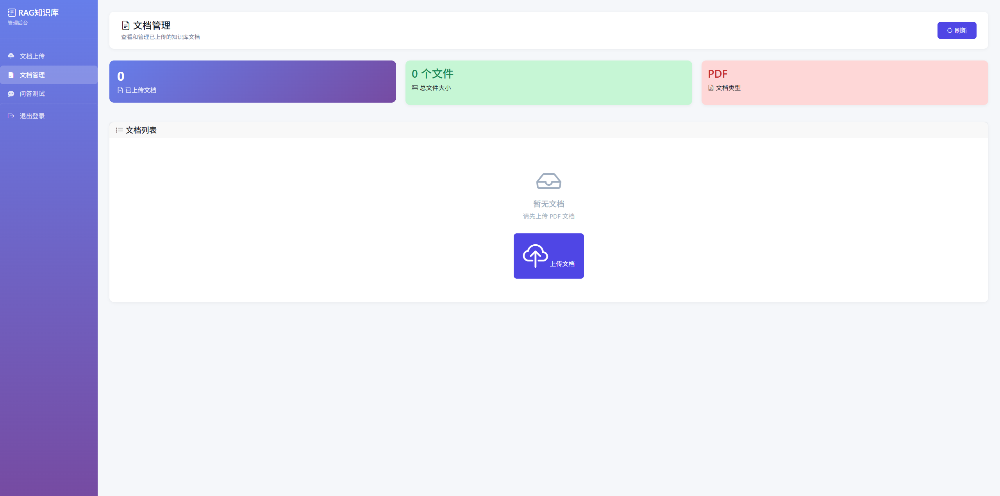
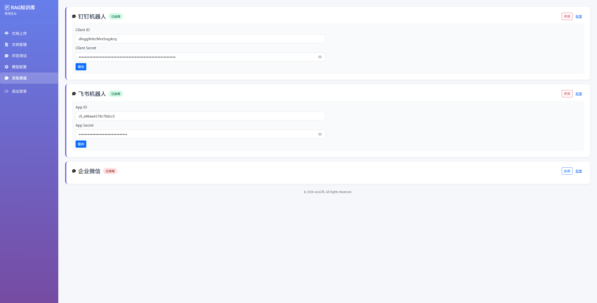
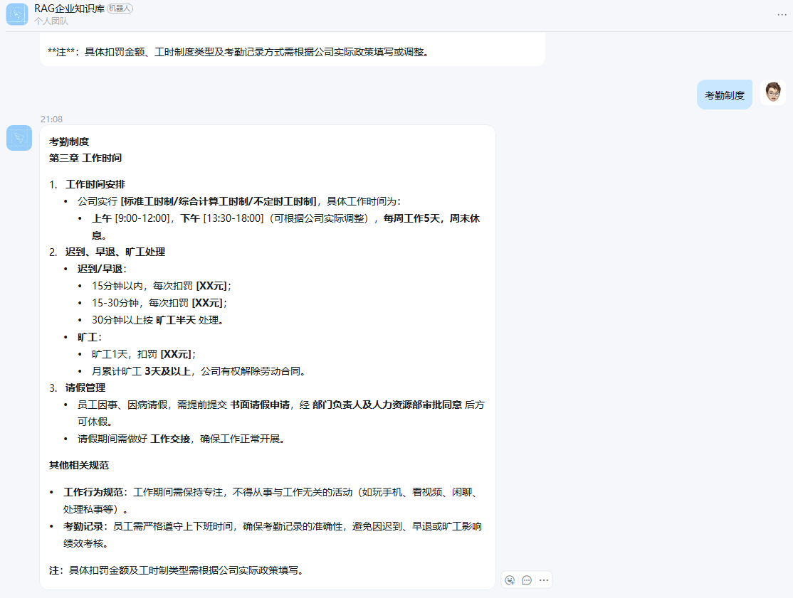

# RAG 知识库系统

[English](README_en.md) | 中文

基于 LangChain4j 的 RAG（Retrieval-Augmented Generation，检索增强生成）知识库问答系统，支持 Web 管理后台、REST API、流式问答，并集成飞书与钉钉机器人。

## 功能特性

- **RAG 全流程**：PDF 解析、分块、向量化、Milvus 检索、LLM 生成
- **多模型支持**：DashScope（云端）、Ollama（本地）、OpenAI 协议模型可切换
- **双入口调用**：管理后台页面 + 开放 REST API
- **流式问答**：支持 SSE 流式输出
- **机器人接入**：飞书机器人、钉钉机器人
- **可观测性**：关键链路日志（含检索增强阶段耗时）
- **模型配置管理**：支持后台界面实时配置 LLM 和 Embedding 模型
- **消息渠道管理**：支持飞书、钉钉机器人启用/停用

## 技术栈

- Java 21
- Spring Boot 4.0.5
- LangChain4j 0.36.2
- Milvus 2.4.x
- Hutool 5.8.x
- Docker / Docker Compose

## 项目结构

```
src/main/java/com/bin/ragknowledge/
├── controller/     # 页面与 API 控制器
├── service/       # 核心业务逻辑
├── repository/    # 数据访问层
├── config/       # 配置类
└── enums/        # 枚举常量
```

核心资源：
- `src/main/resources/application.yml`：系统配置
- `docker-compose.yml`：Milvus + MinIO + Etcd + 应用一体化编排

## 快速开始

### 方式一：Docker Compose（推荐）

1. 准备 `.env` 文件（可参考 `.env.example`）
2. 配置环境变量
3. 启动服务：
   - Windows：`start.bat`
   - macOS/Linux：`docker-compose up -d`
4. 访问应用：`http://localhost:8080`

停止服务：
- Windows：`stop.bat`
- macOS/Linux：`docker-compose down`

### 方式二：本地 Java 启动

前提条件：
- 已安装 Java 21
- 已安装 Maven
- 已准备可访问的 Milvus 与模型服务

步骤：
1. 构建项目：`mvn clean package -DskipTests`
2. 启动应用：`java -jar target/rag-knowledge-base-1.0.0.jar`
3. 停止应用：`停掉进程即可`

## 核心配置说明

配置文件：`src/main/resources/application.yml`

| 配置项 | 说明 |
|--------|------|
| `milvus.host` / `milvus.port` | Milvus 地址 |
| `rag.chunk.max-segment-size` | 分块大小 |
| `rag.chunk.max-overlap-size` | 分块重叠 |
| `rag.retrieval.max-results` | 检索返回条数 |
| `rag.retrieval.min-score` | 检索最低相似度阈值 |

## 管理后台

访问 `/admin` 进入管理后台：

| 页面 | 路径 | 说明 |
|------|------|------|
| 文档上传 | `/admin/upload` | PDF 文档上传与解析 |
| 文档管理 | `/admin/documents` | 已上传文档列表与删除 |
| 问答测试 | `/admin/chat` | RAG 问答测试 |
| 模型配置 | `/admin/config` | LLM/Embedding 模型配置 |
| 消息渠道 | `/admin/channel` | 飞书/钉钉机器人配置 |

### 模型配置

访问 `/admin/config` 管理 LLM 和 Embedding 模型配置：

- **LLM 配置**：支持 DashScope、Ollama、OpenAI 三种模式
- **Embedding 配置**：支持 DashScope、Ollama、OpenAI 三种模式

每种模式可独立配置 API Key、服务地址、模型名称、超时时间等参数，支持实时切换和保存。

### 消息渠道

访问 `/admin/channel` 配置消息渠道：

- **飞书机器人**：appId + appSecret
- **钉钉机器人**：clientId + clientSecret

支持启用/停用，配置保存后自动生效。

> 建议使用环境变量覆盖敏感配置，不要将真实密钥提交到仓库。

## 接口说明

基础路径：`/api`

| 接口 | 方法 | 说明 |
|------|------|------|
| `/api/upload` | POST | 上传单个 PDF |
| `/api/upload/batch` | POST | 批量上传 PDF |
| `/api/query` | POST | 非流式问答 |
| `/api/health` | GET | 健康检查 |

管理后台路径：`/admin`

| 接口 | 方法 | 说明 |
|------|------|------|
| `/admin/api/query/stream` | POST | 流式问答（SSE） |
| `/admin/api/documents` | GET | 文档列表 |
| `/admin/api/document/{id}` | DELETE | 删除文档 |
| `/admin/api/config/llm` | GET/PUT | LLM 配置 |
| `/admin/api/config/embedding` | GET/PUT | Embedding 配置 |
| `/admin/api/channel/list` | GET | 消息渠道列表 |
| `/admin/api/channel/{type}` | PUT | 更新消息渠道 |

## 常见问题

- **启动后无法检索到结果**：检查 Milvus 连通性、Embedding 维度与模型是否匹配。
- **回答速度慢**：可降低检索结果数量，或切换更快的模型。
- **Docker 启动失败**：先执行 `docker-compose logs -f` 查看依赖服务是否健康。
- **模型配置不生效**：确认保存后刷新页面，必要时重新启动应用。

## Web 效果图







## 飞书机器人效果图


## 钉钉机器人效果图

